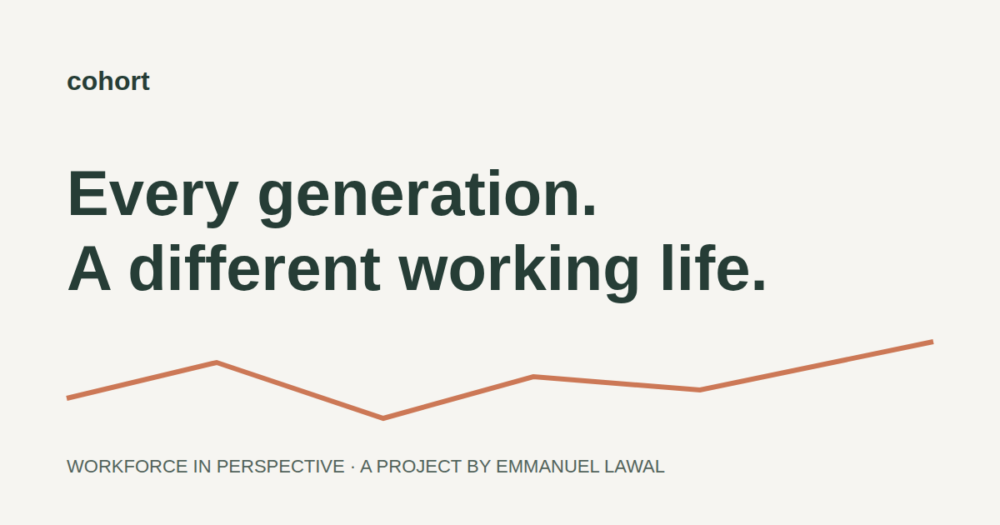

# Cohort — Workforce in perspective

A responsive employment data explorer designed and built by [Emmanuel Lawal](https://emmanuellawal.dev). Compare four generation labels across unemployment, weekly earnings, labor force participation, and industry employment.



This is a portfolio demonstration, not an official labor statistics product. The archived datasets have unverified provenance and inconsistent age ranges. The application explains these limitations before presenting the charts. See [data provenance](docs/data-provenance.md).

## Run locally

Use **Node 24 LTS** (also specified in `.nvmrc`). Older Node 20.18 installations cannot run the current Vite toolchain.

```sh
nvm use
npm ci
npm run dev
```

Open the local URL printed by Vite, normally `http://localhost:3000`.

```sh
npm run check        # ESLint, data tests, TypeScript, production build
npx playwright install chromium
npm run test:e2e     # Desktop and mobile flows, error recovery, axe accessibility checks
npm run preview     # Serve dist locally
```

The browser suite tests the production build, so run `npm run build` before `npm run test:e2e`. Screenshots are saved in `artifacts/`; failure traces and reports are local ignored output. CI performs the same checks on pushes and pull requests.

## Explore

- Compare any combination of four generations; at least one remains selected.
- Filter the available observation years from 2000 to 2023.
- Switch between unemployment, earnings, and participation. Earnings support nominal or supplied 2023-dollar values.
- Inspect chart values with a pointer or keyboard-operated year buttons. Line dash patterns supplement color.
- Switch to a semantic table with the same filtered values.
- Share the current measure, generation selection, period, and price basis by URL. A manual copy field is available when clipboard access fails.
- Export the filtered measure as CSV with units and a dataset-status warning.
- Explore all 12 industries in a separate 2023 snapshot.
- Read the source limitations and download the original CSV files.

## Engineering decisions

- **React 19 + TypeScript:** a typed data model and explicit loading, error, and ready states.
- **Vite 8:** fast local development and static production output.
- **Custom SVG charts:** responsive chart geometry, true year spacing, zero-based rate axes, visible missing observations, distinct line styles, and matching accessible tables. No chart-library dependency.
- **Papa Parse:** strict CSV validation, duplicate-key detection, generation/year joins, and safe CSV serialization. Invalid numbers are not coerced to zero.
- **Plain CSS:** a responsive design system with native controls, visible focus, reduced-motion support, and print styles.
- **Locally bundled DM Sans:** no runtime third-party font request.
- **Vitest, Playwright, and axe:** checks cover data correctness and real user behavior; there is no simulated in-app testing panel.

## Structure

```text
src/App.tsx                       Page shell, brand, methodology
src/components/Explorer.tsx       Filters, comparisons, sharing, export
src/components/IndustryPanel.tsx  Independent industry snapshot
src/components/TrendChart.tsx     SVG trend chart and sparklines
src/components/ErrorBoundary.tsx Render failure recovery
src/hooks/useDataset.ts          Abortable fetch, validation, retry
src/lib/data.ts                  Data model, parser, filters, formatting, export
src/index.css                    Responsive visual system
public/*_by_*.csv                Original archived demonstration datasets
tests/data.test.ts               Data integrity and share/export checks
tests/e2e/explorer.spec.ts        Desktop/mobile browser flows and accessibility
docs/                           Data notes and portfolio case study
```

## Deployment

Build with `npm ci && npm run build` on Node 24. Serve `dist/` from the site root. The existing Vercel configuration is retained; set its runtime to Node 24, build command to `npm run build`, and output directory to `dist`.

No backend, API keys, or environment secrets are needed. Query parameters carry shareable state. This implementation has not been published automatically.

## Before using this as research

Replace the archived files with traceable source records; document the exact series IDs, retrieval date, cohort definitions, transformations, denominators, and inflation methodology. Validate the model and update its tests. Do not relabel these files as verified BLS data.

The unrelated legacy housing, vehicle, and rent files are retained for historical reference but are not used by this explorer. Original source code is recoverable from Git history. No license grant is asserted because this repository has no LICENSE file.
